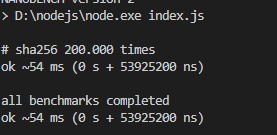

# 前言

总所周知前端生态圈开始使用原生语言进行开发工具链，而rust golang 这种可以编译成二进制可执行文件的原生语言十分一度成为开发者的选择。

而rust拥有非常高的性能的同时，并且保持这以往对于内存管理的一些问题的改进。

虽然其编译自身时间很长，但是编译后的结果运行起来的是相当快的。

第二方面，大多数人在看完rust 的文档后，通常会提出问题下一步应该做些什么。

也是这篇教程的目的之一。

总结上面的介绍，学完这个教程后你能得到什么？

- 编译器的一些概念和执行流程
- rust 基础知识的实践，生命周期，闭包，所有制，测试等
- 一个比postcss 解析语法树更快的解析器。
- 通过使用 wasm 进行浏览器端使用

postcss

我们的编译器

