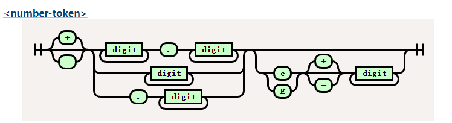

# 词法解析器开发

我们已经实现了 Range，Token。

这边我们直接进入正题，开始实现词法解析。

首先介绍一下词法解析起的运作流程了

```
由语法分析进行调用
获取token -> 是否匹配 --> 消费token
               |
               V
            抛出异常
```

词法解析器的任务是找到一段文本中最小的文本结构，比如`123` `'abc'` 分别是数字和字符串。

那么这些最小的文本结构，我们去哪找它的定义呢？

下面两个连接我们可以得到我们想要的。

[consume-token](https://www.w3.org/TR/css-syntax-3/#consume-token)

[Appendix G. Grammar of CSS 2.2](https://www.w3.org/TR/CSS22/grammar.html)

接下来开始我们的开发吧！

## Lexer 结构与辅助功能

我们创建`src/lexer.rs`文件。

建立 lexer 的结构体

```rust,no_run,noplayground
{{#include ../src/lexer.rs:lexer}}
```

这里有一个 rust 的新手常见的坑，或者说迷惑的地方，就是 String str &str 的关系，老实讲知道现在有时候我也很模糊。

我的理解如下

- str 是静态字符串，编译器存储在二进制文件中。
- String 属于动态字符串，存储在堆中。
- &str 是切片，或者说指针更好一些，他只是一个指向内存地址的指针

```rust
# fn main() {
     let x = "i am str";
    // "i am str" 这是str 存储在二进制中
    // x 是指向 str 的指针，所以他的类型是 &str
    let y = String::from("string");
    // 转化 y 到 &str
    let z = &y[..];
    //  z &str
    // z 是指向y的指针
# }
```

这里的 chars 是 source_code 的切片，方便我们进行字符遍历。

后面我们会使用这个迭代器进行迭代，受益于 rust 的零成本抽象，他的性能非常高。

有了结构，接下来我们实现一些辅助函数，用来操作光标。

我们在某些场景下不仅仅需要感知当前字符，还需要感知下一个字符。

所以我们定义一下几个方法。

```rust,no_run,noplayground
{{#include ../src/lexer.rs:handle_char}}
```

这段代码中存在几个问题，我们使用了关键字 `pub` 作为方法前缀，但是这些方法只对内使用，所以这是一个错误的用法。

第二，这部分我们应该使用缓存，存储上一次获得的结果，因为`clone`方法会影响性能。

```rust,no_run,noplayground
 // 思考：有没有什么更好的优化手段？
self.chars.clone().nth(0).map(|x| x.1)
```

```rust,no_run,noplayground
{{#include ../src/lexer.rs:get_token}}
```

最后我们通过`Lexer::new` 创建 lexer 实例

```rust,no_run,noplayground
{{#include ../src/lexer.rs:new}}
```

这里的`advence`相当开启了机器，词法解析器将不停的吞噬下一个字符，直到文本的最后。

接下来我们实现 lexer 的主要方法，`Token` 创建器。

为了限制篇幅，我只做 3 个介绍，剩下的大家可以看源码或者是课后作业，自行实现一遍，感受词法解析器的过程。

1. **简单符号解析**

```rust,no_run,noplayground
 '(' | ')' | ',' | ':' | ';' | '<' | '>' | '[' | '\\' | ']' | '{' | '}' | '=' => {
                    return self.parse_simple_symbol(ch)
                }

//parse_simple_symbol
{{#include ../src/lexer.rs:parse_simple_symbol}}
```

首先我们通过 `match` 匹配当前字符串，这个语法就好像一个功能更加强大的`switch`语法,`_=>{}` 就相当于`default`。

最终返回，我们的元组结构体`Token`。

是不是很简单，接下来我们把难度提升一点，来实现`Comment`的解析。

2. 解析 Comment

在 css 语法中只有一种注释，那就是`/* */`。

```rust,no_run,noplayground
'/' => return self.try_comment(),

//try_comment
{{#include ../src/lexer.rs:try_comment}}
```

首先当当前字符匹配到`/`时候我们调用方法`try_comment`。

当下一个字符是`*`的时候，我们确认当前是一个注释，所以我们贪婪的获取下一个字符，指导遇见下一个`*/`。

如果下一个字符不是`*`时候，我们返回斜杠类型，这个 token 类型会在分析函数的时候使用比如`calc(1px / 2px)`。

实际上这里应该返回`Option`类型，但是如果全部都返回`Option`显得很繁琐，所以我这里就这报错了，`Option`提供两个枚举值，一个是`Some<T>`，一个是`None`，代表有值无值两种，从而比免了`null`的设计问题。

好的，限制我们开始渐入佳境，有没有感觉到，在这个案例中，通过`if`进行不同状态的匹配呢？

接下来，我们看一个更复杂的有限状态机数字类型。

3. 数字类型解析

几乎所有的编程语言都拥有数字类型，实际上要写一个计算器的语法解析器也是十分复杂的。

我们来看下为什么数字类型这么复杂。



这是我们要实现的铁轨图。

`digit` 在 css 中比较简单代表`0-9`字符。

大家有兴趣可以看一下 lua 的[数字类型的正则铁轨图](https://regexper.com/#%2F%5E0%5BxX%5D%5B0-9a-fA-F%5D*%28%5C.%5B0-9a-fA-F%5D*%29%3F%28%5BpP%5D%5B%2B%5C-%5D%3F%5B0-9%5D%2B%29%3F%7C%5E%5B0-9%5D*%28%5C.%5B0-9%5D*%29%3F%28%5BeE%5D%5B%2B%5C-%5D%3F%5B0-9%5D%2B%29%3F%2F)十分复杂。

还记得我们在开头说的吗？词法解析器就是一个有限状态机的实现，所以虽然看起来很复杂，但是有了铁轨图的帮助，我们还是能顺利编写的。

```rust,no_run,noplayground
ch if ch.is_ascii_digit() || ch == '.' || ch == '+' || ch == '-' => {
    return self.parse_digit_token()
}

//try_digit
{{#include ../src/lexer.rs:try_digit}}
```

大家看最开始的匹配开始字符的语法，这是 match 守卫，可以在捕获变量后，添加一个 if 条件块进行进一步的确认。

首先，我们通过前瞻确认他到底是不是一个数字，如果不是我们就返回他的原始符号类型。

如果是我们便根据铁轨图的逻辑一步步吞噬 token，直到下一个 token 不在匹配。

## 测试我们的成果

接下来开始测试我们写的成果。

我们在测试目录`tests`下创建`test_lexer.rs`。

创建 mod

```rust,no_run,noplayground
#[cfg(test)]
mod test_lexer {
}
```

为了方便测试我们使用宏来减少自己的模板代码。

```rust,no_run,noplayground
//test_lexer
{{#include ../tests/test_lexer.rs:test_token}}
```

这段代码中，创建了`lexer`的实例，然后消费一个 token，最后检测消费的 token 是否是我们想要的类型。

```rust,no_run,noplayground
//test_simple_symbol
{{#include ../tests/test_lexer.rs:lexer_test_example}}
```

好的，我们看我们的测试代码变得十分精简，这都是得益于 rust 的宏魔法。

最后我们来运行测试一下`cargo test lexer`。

```sh
running 21 tests
test test_lexer::test_all_match_token ... ok
test test_lexer::test_at_token ... ok
test test_lexer::test_complexe_url_token ... ok
```

大公告成，我们已经完成了我们的词法解析器啦，当然还有很多没有完成的词法，需要你自行探索有，代码最开始写的有问题也不要灰心哦，不断的实践才能让理论知识更加熟练，加油吧少年。

在下一部分，我们将会实现我们的语法解析部分，会涉及 ast 语法树哦，敬请期待。

